# Premium GitHub Profile README System

A reusable, theme-aware GitHub profile system built around a premium terminal/editor interface, glass surfaces, ASCII-style visual identity, restrained animation, and factual profile data.

## Files

- `dark.svg` — dark theme hero
- `light.svg` — light theme hero
- `README.md` — theme-aware profile README template

## Personalization contract

This repository intentionally contains **placeholders only**. Replace placeholders using information explicitly supplied by the profile owner.

Do not invent:

- employment or education
- job titles
- companies or clients
- technologies
- projects
- metrics
- certifications or awards
- dates
- locations
- URLs
- professional claims

If a field is unavailable, remove that row instead of creating a fictional value.

### Supported fields

```text
{{NAME}}
{{PROFESSIONAL_HEADLINE}}
{{PRIMARY_ROLE}}
{{CURRENT_COMPANY}}
{{LOCATION}}
{{EXPERIENCE}}
{{FOCUS}}
{{PRIMARY_TECHNOLOGIES}}
{{CURRENT_BUILDING_FOCUS}}
{{PERSONAL_TAGLINE}}

{{PROJECT_1_NAME}}
{{PROJECT_1_DESCRIPTION}}
{{PROJECT_2_NAME}}
{{PROJECT_2_DESCRIPTION}}

{{GITHUB_URL}}
{{LINKEDIN_URL}}
{{PORTFOLIO_URL}}
{{EMAIL}}
```

For a supplied portrait, replace the illustrative ASCII region in the SVG with generated SVG character data derived from that image. Do not embed the original raster portrait when an ASCII treatment has been requested.

---

## Hero

<picture>
  <source media="(prefers-color-scheme: dark)" srcset="./dark.svg">
  <source media="(prefers-color-scheme: light)" srcset="./light.svg">
  
</picture>

---

## About / Focus

<!-- Keep this factual and concise. Remove the section if profile data does not support it. -->

`{{SHORT_FACTUAL_INTRODUCTION}}`

### Current focus

- `{{FOCUS_ITEM_1}}`
- `{{FOCUS_ITEM_2}}`
- `{{FOCUS_ITEM_3}}`

---

## Experience

<!-- Add only documented experience. Remove this section if unavailable. -->

### `{{ROLE}}` · `{{COMPANY}}`

`{{DATE_RANGE_IF_SUPPLIED}}`

`{{ONE_OR_TWO_SENTENCE_FACTUAL_DESCRIPTION}}`

---

## Featured Projects

<!-- Use only supplied projects and factual descriptions. -->

### `{{PROJECT_1_NAME}}`

`{{PROJECT_1_DESCRIPTION}}`

- Stack: `{{PROJECT_1_STACK}}`
- Link: `{{PROJECT_1_URL}}`

### `{{PROJECT_2_NAME}}`

`{{PROJECT_2_DESCRIPTION}}`

- Stack: `{{PROJECT_2_STACK}}`
- Link: `{{PROJECT_2_URL}}`

---

## Engineering Stack

Organize only technologies that are supported by the supplied profile.

| Area | Technologies |
|---|---|
| Languages | `{{LANGUAGES}}` |
| Frontend | `{{FRONTEND}}` |
| Backend | `{{BACKEND}}` |
| Data | `{{DATABASES_AND_DATA}}` |
| Cloud / DevOps | `{{CLOUD_DEVOPS}}` |
| AI / ML | `{{AI_ML}}` |
| Architecture / Systems | `{{ARCHITECTURE_SYSTEMS}}` |
| Tools | `{{TOOLS}}` |

Remove rows that do not apply.

---

## Writing / Content

<!-- Optional. Include only if the profile owner supplied published writing, talks, papers, tutorials, or similar work. -->

- `{{CONTENT_TITLE}}` — `{{CONTENT_LINK}}`

---

## GitHub Activity

<!-- Optional. Keep this section simple and avoid unsupported claims. -->

`{{OPTIONAL_GITHUB_ACTIVITY_CONTENT}}`

---

## Connect

Use only supplied URLs.

- GitHub: `{{GITHUB_URL}}`
- LinkedIn: `{{LINKEDIN_URL}}`
- Portfolio: `{{PORTFOLIO_URL}}`
- Email: `{{EMAIL}}`

Remove unavailable links.

---

## Design system

The SVGs share one composition:

```text
┌─────────────────────────────────────────────────────────────────────────┐
│ terminal chrome                                                         │
├───────────────────────────────┬─────────────────────────────────────────┤
│                               │ SYSTEM.INFO                             │
│        VISUAL.MAP             │                                         │
│                               │ concise profile facts                   │
│     ASCII / dot portrait      │ role · focus · stack · building         │
│                               │                                         │
│       identity                │ selected projects                       │
│                               │ links                                   │
└───────────────────────────────┴─────────────────────────────────────────┘
```

### SVG guarantees

- `1180 × 610` viewBox
- responsive via intrinsic SVG sizing
- self-contained XML
- no JavaScript
- no external CSS
- no external fonts
- no remote assets
- SMIL animation only
- accessible `role="img"` and descriptive `<title>/<desc>`
- restrained motion
- separate dark and light visual systems
- GitHub-compatible `<picture>` switching
- factual placeholders instead of invented profile claims

### Motion principles

Animation is deliberately subtle:

- ambient gradient movement
- restrained border shimmer
- slow particles
- scanline movement
- cursor pulse
- portrait reveal/scan treatment

The composition remains understandable without animation support.

---

## Customization workflow

1. Gather the profile owner's supplied profile data.
2. Resolve conflicts by preferring the most recent explicit information; omit unresolved conflicts.
3. Remove unsupported fields.
4. Replace the placeholders in `dark.svg` and `light.svg`.
5. If a personal portrait was supplied and ASCII rendering is requested, convert it into dense SVG character data and replace the illustrative portrait.
6. Replace the factual placeholders in this README.
7. Validate the SVG as XML before committing.
8. Preview both themes in GitHub.

> The banner is intentionally an identity layer, not a complete resume. Keep detailed information in the README and use the hero for fast professional orientation.
